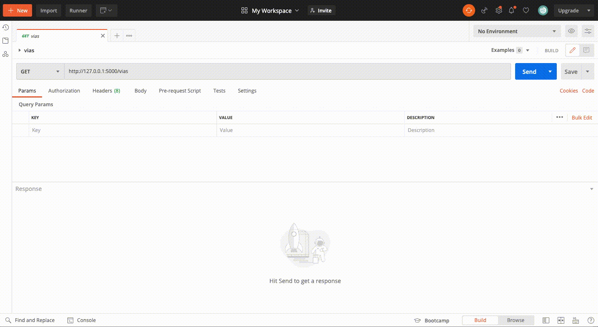

# App de Visualização de Dados

Essa aplicação contempla um dashboard (para visualização e interação com os dados), uma API (com endpoints que fornecem os dados provindo de arquivos csv) e um python bot (verifica disponibilidade de dados online de forma automática).

## Sobre

Esse projeto contempla três entregas que formam um desafio:
- API: Escrita em Python por meio do micro framework [Flask](https://flask.palletsprojects.com/en/2.0.x/) possui três endpoints. Esses endpoints fornecem informações provindas de arquivos csv (para baixá-los ver a seção de 'Outras Observações').
- Dashboard: Um dashboard com três filtros (ANO, MOVIMENTACAO e PRODUTO) e quatro campos de visualização de dados: Card de total movimentado; Gráfico de Barras com a quantidade de importação ou exportação, Gráfico de Pizza com percentual de utilização da VIA e Tabela com total por estado brasileiro e nível de influência na importação ou exportação. Utilizou-se [Dash](https://dash.plotly.com/introduction) para construção do dashboard.
- Python Bot: Verifica se há bases disponíveis de forma automático para os três últimos anos no site do Comércio Extreio - Governo Federal. Foi escrito em python e para melhor entendimento, usou-se o [Jupyter](https://jupyter.org/).

## API

A REST-API possui três endpoints:
- /products
- /vias   
- /comex

A seguir é mostrado a utilização de um dos endpoints.

<p align="center">

</p>

## Dashboard

Três tecnologias constituem o núcleo do [Dash](https://dash.plotly.com/introduction):

- [Flask](https://flask.palletsprojects.com/en/2.0.x/) fornece a funcionalidade do servidor web.
- [React.js](https://pt-br.reactjs.org/) renderiza a interface do usuário da página da web.
- [Plotly.js](https://plotly.com/javascript/) gera os gráficos usados em seu aplicativo.

Demonstração do aplicativo de dashboard. 
<p align="center">

</p>

## Uso do Python Bot

Após realizada a instalação das bibliotecas do projeto, disponíveis em 'requirements.txt', coloque no terminal o seguinte comando: 

```bash
# Inicializando o jupyter notebook
$ jupyter notebook
```

Depois basta em ir 'Kernel' e 'Restart & Run All'. Após isso o bot fará tudo sozinho. Se houver disponibilidade de dados o bot retornará uma base de dados chamada 'f_comex.csv' com movimentação de exportação e importação dos últimos três anos.

## Tecnologias

- [Dash](https://dash.plotly.com/introduction)
- [POSTMAN](https://www.postman.com/)
- [Jupyter](https://jupyter.org/)
- [Flask](https://flask.palletsprojects.com/en/2.0.x/)
- [Python](https://www.python.org/)


## Outras Observações
Foram utilizadas algumas bases de dados, siga as seguintes intruções para as utilizar:

1. Acessar as bases por meio do link:
https://drive.google.com/drive/u/1/folders/1GzRgHjeUFPkrseYln9uwISmhbiys6rUj

2. Fazer o download dos arquivos.

3. Colocar arquivos na pasta 'datasets' na raiz do projeto.